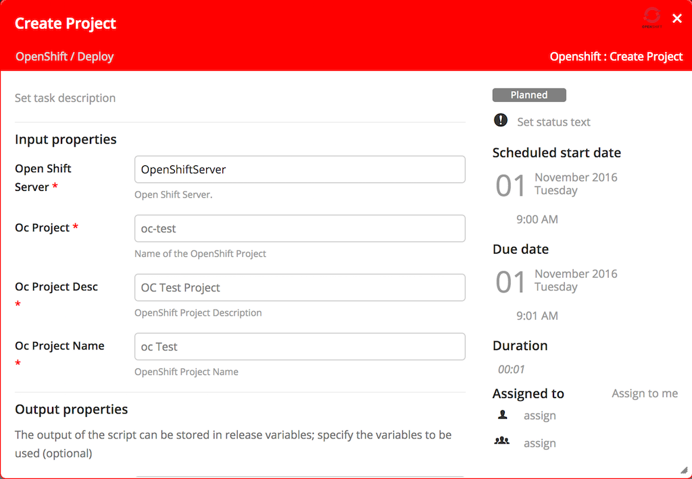
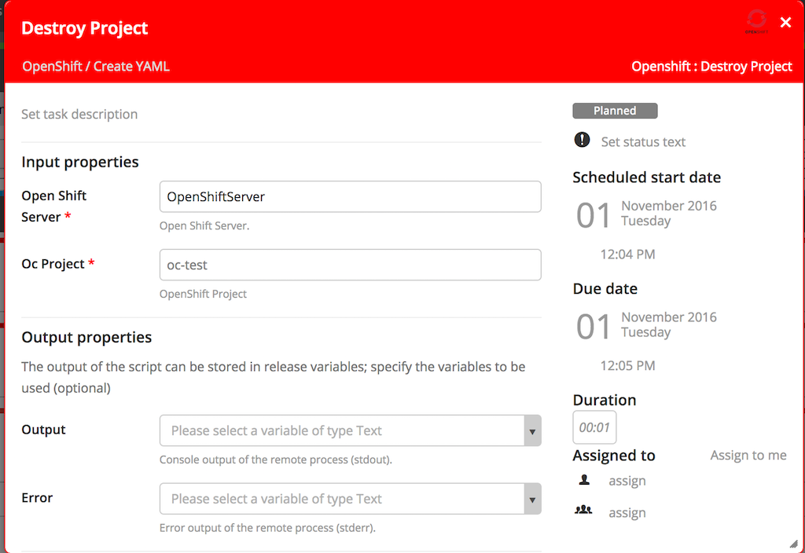
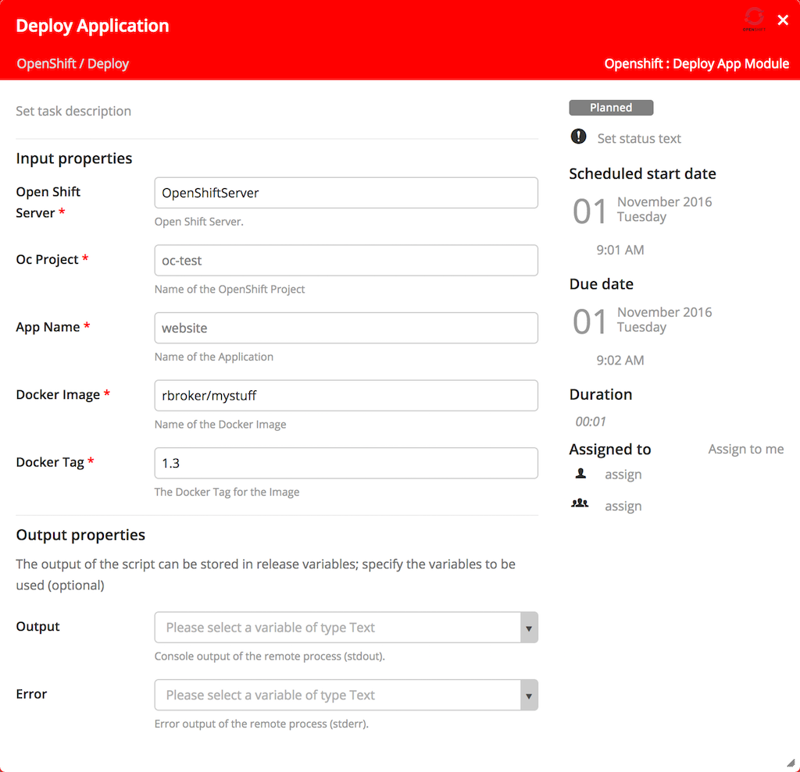
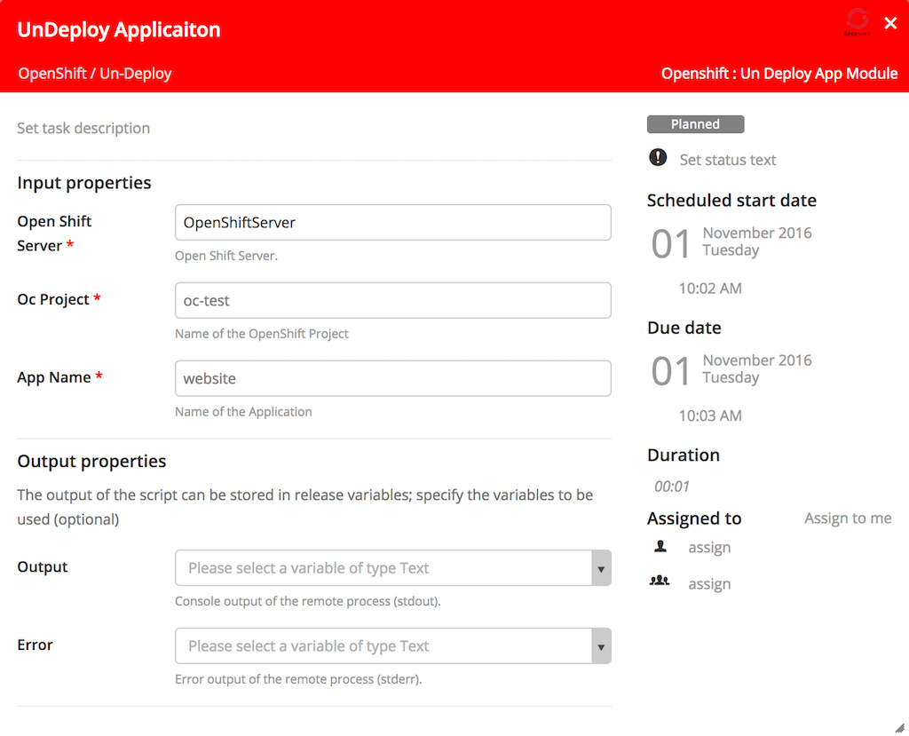
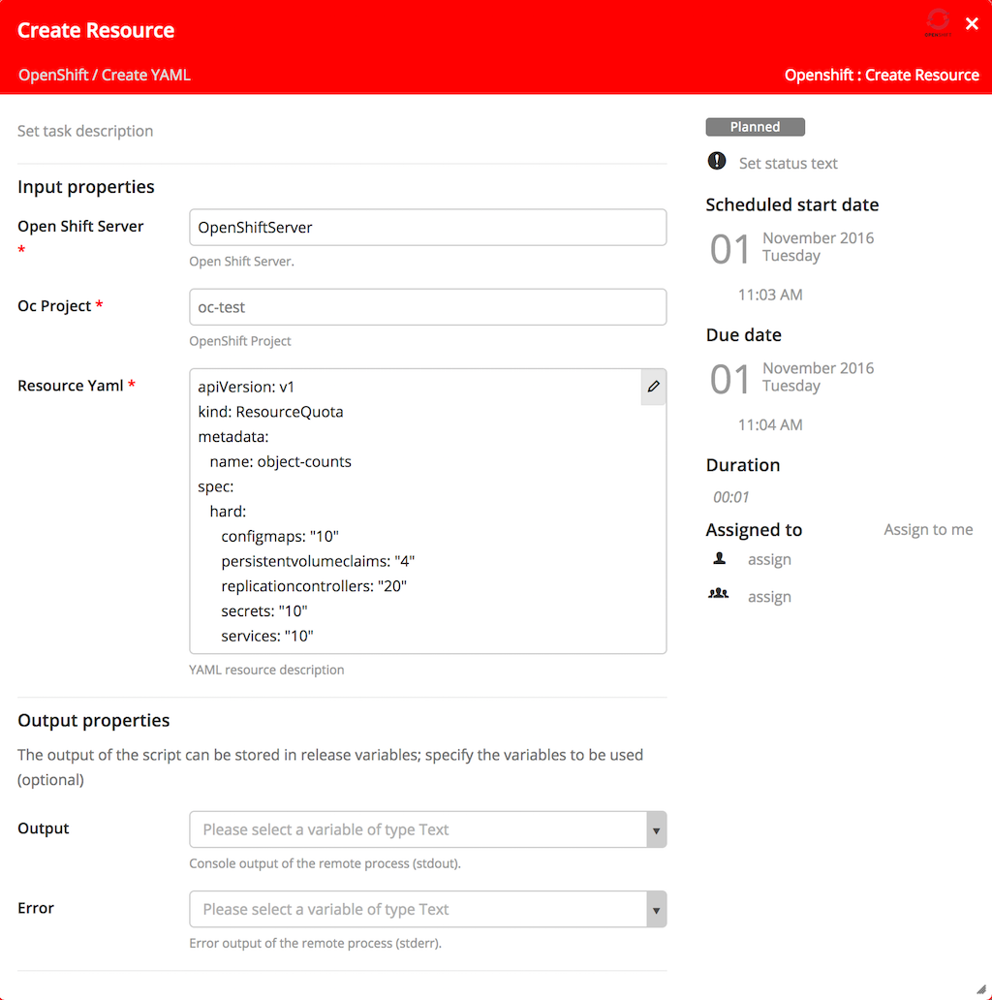

#XL Release OpenShift Plugin

## Preface
This document descripts the functionality provide by the `xlr-openshift-plugin`

## Overview
This module offers tasks to apply Ansible playbooks on a remote hosts.

## Requirements
	
* XL Release 5.0+
* oc client on target machine for OpenShift v3

## Installation
Copy the plugin JAR file into the `SERVER_HOME/plugins` directory of XL Release.

## Tasks

### Create Project

### Destroy Project

### Deploy App Module

### Un-Deploy App Module

### Create Resource

